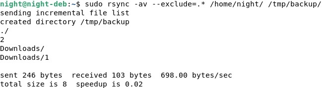
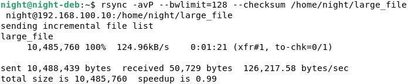

# Резервное копирование
## Домашнее задание. Горбунов Владимир

## Цель задания
1. Настраивать регулярные задачи на резервное копирование (полная зеркальная копия)
2. Настраивать инкрементное резервное копирование с помощью rsync

## Содержание

- [Задание 1. Rsync. Зеркальная копия с проверкой хэшей](#Задание-1)
- [Задание 2. Rsync + cron](#Задание-2)  
- [Задание 3. HAProxy + nginx + simple python server](#Задание-3) 
- [Задание 4. HAProxy. Два бекэнда, simple python server](#Задание-4)  

## Задание 1
> Составьте команду rsync, которая позволяет создавать зеркальную копию домашней директории пользователя в директорию `/tmp/backup`  
Необходимо исключить из синхронизации все директории, начинающиеся с точки (скрытые) 
Необходимо сделать так, чтобы rsync подсчитывал хэш-суммы для всех файлов, даже если их время модификации и размер идентичны в источнике и приемнике. 
На проверку направить скриншот с командой и результатом ее выполнения 

Text.

## Задание 2
> Написать скрипт и настроить задачу на регулярное резервное копирование домашней директории пользователя с помощью rsync и cron. 
Резервная копия должна быть полностью зеркальной 
Резервная копия должна создаваться раз в день, в системном логе должна появляться запись об успешном или неуспешном выполнении операции 
Резервная копия размещается локально, в директории `/tmp/backup` 
На проверку направить файл crontab и скриншот с результатом работы утилиты.

Text

[file](./file)

## Задание 3

> Настройте ограничение на используемую пропускную способность rsync до 1 Мбит/c  
Проверьте настройку, синхронизируя большой файл между двумя серверами 
На проверку направьте команду и результат ее выполнения в виде скриншота

text

## Задание 4
> Напишите скрипт, который будет производить инкрементное резервное копирование домашней директории пользователя с помощью rsync на другой сервер  
Скрипт должен удалять старые резервные копии (сохранять только последние 5 штук)  
Напишите скрипт управления резервными копиями, в нем можно выбрать резервную копию и данные восстановятся к состоянию на момент создания данной резервной копии. 
На проверку направьте скрипт и скриншоты, демонстрирующие его работу в различных сценариях.

text

