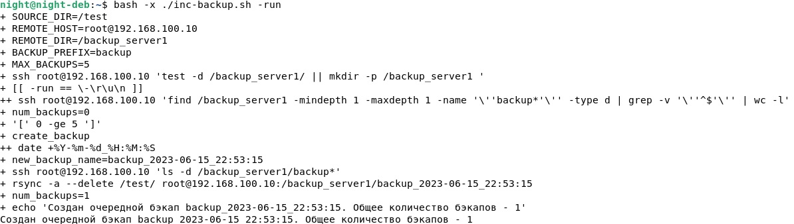
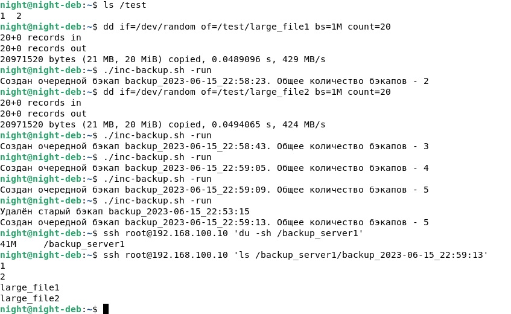
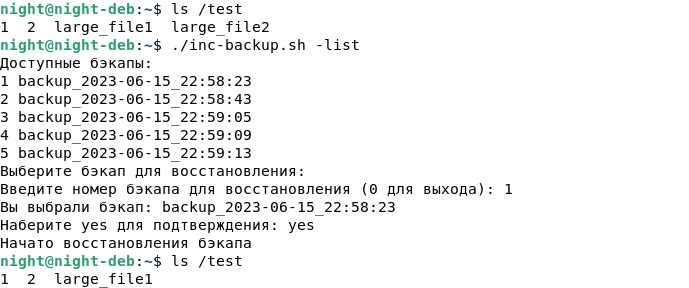

# Резервное копирование
## Домашнее задание. Горбунов Владимир

## Цель задания
1. Настраивать регулярные задачи на резервное копирование (полная зеркальная копия)
2. Настраивать инкрементное резервное копирование с помощью rsync

## Содержание

- [Задание 1. Rsync. Зеркальная копия с проверкой хэшей](#Задание-1)
- [Задание 2. Rsync + cron](#Задание-2)  
- [Задание 3. Синхронизация большого файла. Пропускная способность](#Задание-3) 
- [Задание 4. Инкрементное резервное копирование](#Задание-4)  


## Задание 1
> Составьте команду rsync, которая позволяет создавать зеркальную копию домашней директории пользователя в директорию `/tmp/backup` </br>
Необходимо исключить из синхронизации все директории, начинающиеся с точки (скрытые)</br>
Необходимо сделать так, чтобы rsync подсчитывал хэш-суммы для всех файлов, даже если их время модификации и размер идентичны в источнике и приемнике.</br>
На проверку направить скриншот с командой и результатом ее выполнения</br>

>rsync -avP --checksum --exclude=".*" ~/ /tmp/backup


## Задание 2
> Написать скрипт и настроить задачу на регулярное резервное копирование домашней директории пользователя с помощью rsync и cron.</br>
Резервная копия должна быть полностью зеркальной</br>
Резервная копия должна создаваться раз в день, в системном логе должна появляться запись об успешном или неуспешном выполнении операции</br>
Резервная копия размещается локально, в директории `/tmp/backup`</br>
На проверку направить файл crontab и скриншот с результатом работы утилиты.

[backup.sh](./backup.sh)
```bash
#!/bin/bash

# Исходная директория
SOURCE_DIR="/home/night"
# Целевая директория
TARGET_DIR="/tmp/backup"
# Команда rsync. Cтандартный вывод - в /dev/null, ошибки - в лог.
rsync -a --checksum --exclude=".*" "$SOURCE_DIR" "$TARGET_DIR" > /dev/null 2>> /var/log/backup.log

# Проверка кода завершения rsync и запись лога
if [ $? -eq 0 ]; then
    echo "[$(date)] Резервное копирование успешно выполнено" >> /var/log/backup.log
else
    echo "[$(date)] Ошибка при выполнении резервного копирования" >> /var/log/backup.log
fi

```
[/var/spool/cron/crontabs/night](./night):
```bash
0 0 * * * /home/night/backup.sh
```


## Задание 3

> Настройте ограничение на используемую пропускную способность rsync до 1 Мбит/c </br>
Проверьте настройку, синхронизируя большой файл между двумя серверами</br>
На проверку направьте команду и результат ее выполнения в виде скриншота

- Файл размером 10Мб:
>dd if=/dev/random of=/home/night/large_file bs=1M count=10

- Ограничение до 1 Мбит (128Кб/c)
>rsync -avP --bwlimit=128 --checksum /home/night/large_file  night@192.168.100.10:/home/night/large_file


## Задание 4
> Напишите скрипт, который будет производить инкрементное резервное копирование домашней директории пользователя с помощью rsync на другой сервер </br>
Скрипт должен удалять старые резервные копии (сохранять только последние 5 штук) </br>
Напишите скрипт управления резервными копиями, в нем можно выбрать резервную копию и данные восстановятся к состоянию на момент создания данной резервной копии.</br>
На проверку направьте скрипт и скриншоты, демонстрирующие его работу в различных сценариях.

- Скрипт запускается с параметрами -run (производится бэкап) или -list (выводится список бэкапов и предлагается выбрать нужный для восстановления)
- Бэкапы хранятся на удалённом сервере. Каждый следующий бэкап линкуется с предыдущим бэкапом (опция --link-dest, создаются hard link), таким образом экономится место на диске удалённого сервера, дублирующиеся между бэкапами файлы являются хард линками и при удалении предыдущего бэкапа все пересекающиеся файлы остаются доступны в других бэкапах


```bash
#!/bin/bash

# Параметры скрипта
SOURCE_DIR="/test"
REMOTE_HOST="root@192.168.100.10"
REMOTE_DIR="/backup_server1"
BACKUP_PREFIX="backup"
MAX_BACKUPS=5

# Проверяем создана ли директория в которую будут записаны бэкапы
ssh "$REMOTE_HOST" "test -d $REMOTE_DIR/ || mkdir -p $REMOTE_DIR "

# Функция для создания инкрементного бэкапа.
# В rsync указываем в качестве референсной директории - предыдущий бэкап на удаленном сервере.
# Создаём очередной бэкап c датой и временем в имени, в дальнейшем получить имя самого нового или 
# самого старого бэкапа можно просто выполнив ls [-r] | grep backup | tail -1
# Проверяем были ли созданы бэкапы до этого. Если папка пустая, то создаём первый (без опции -link-dest)
create_backup() {
  new_backup_name="${BACKUP_PREFIX}_$(date +%Y-%m-%d_%H:%M:%S)"
  if ssh "$REMOTE_HOST" "ls -d $REMOTE_DIR/${BACKUP_PREFIX}*" >/dev/null 2>&1 ; then 
      latest_backup=$(ssh "$REMOTE_HOST" "ls $REMOTE_DIR/ | grep $BACKUP_PREFIX | tail -1")
      rsync -a --link-dest="$REMOTE_DIR/$latest_backup" --delete  "$SOURCE_DIR/" "$REMOTE_HOST:$REMOTE_DIR/$new_backup_name"
  else
      rsync -a --delete  "$SOURCE_DIR/" "$REMOTE_HOST:$REMOTE_DIR/$new_backup_name"
  fi
}

# Функция для удаления самого старого бэкапа при количестве бэкапов более MAX_BACKUPS
delete_oldest_backup() {
  oldest_backup=$(ssh "$REMOTE_HOST" "ls -r $REMOTE_DIR/ | grep $BACKUP_PREFIX | tail -1")
  ssh "$REMOTE_HOST" "rm -rf $REMOTE_DIR/$oldest_backup"
}
if [[ "$1" == "-run" ]]; then
    # Подсчитываем количество бэкапов, если их больше MAX_BACKUPS, то удаляем самый старый бэкап и пишем следующий
    num_backups=$(ssh "$REMOTE_HOST" "find $REMOTE_DIR -mindepth 1 -maxdepth 1 -name '$BACKUP_PREFIX*' -type d | grep -v '^$' | wc -l")
    if [ "$num_backups" -ge "$MAX_BACKUPS" ]; then
        delete_oldest_backup
        num_backups=$(( num_backups - 1 ))
        echo "Удалён старый бэкап $oldest_backup"
    fi
    create_backup
    num_backups=$(( num_backups + 1 ))
    echo "Создан очередной бэкап $new_backup_name. Общее количество бэкапов - $num_backups"

elif [[ "$1" == "-list" ]]; then
    backups_list=$(ssh "$REMOTE_HOST" "ls $REMOTE_DIR/ | grep $BACKUP_PREFIX ")
    echo "Доступные бэкапы:"
    echo "$backups_list" | awk '{print NR,$0}'
    echo "Выберите бэкап для восстановления:"
    read -p "Введите номер бэкапа для восстановления (0 для выхода): " selected_number
    if [[ ! "$selected_number" =~ ^[0-9]+$ || -z "$selected_number" ||  "$selected_number" -lt 0  ||  "$selected_number" -gt  "$MAX_BACKUPS" ]]; then
        echo "Некорректное значение"
        exit 1
    elif [[ "$selected_number" -eq 0 ]]; then
        echo "Выход"
        exit 0
    fi
    selected_backup=$(echo "$backups_list" | awk -v num="$selected_number" 'NR==num {print}')
    echo "Вы выбрали бэкап: $selected_backup"
    read -p "Наберите yes для подтверждения: " user_verify
    if [[ "$user_verify" == "yes" || "$user_verify" == "YES" ]]; then
        echo "Начато восстановления бэкапа"
        rsync -a --delete "$REMOTE_HOST:$REMOTE_DIR/$selected_backup/" "$SOURCE_DIR"
    else
        echo "Выход"
        exit 0
    fi
else
    echo "Неправильная команда. Доступны команды: incr-backup.sh -list|-run"
    exit 1
fi

```
- Первый запуск скрипта:

- В тестовой папке создано два файла размером по 20Мб, скрипт запущен 6 раз, на 6й раз был удалён первый бэкап.
- Размер всей директории с пятью бэкапами на удалённом сервере - 41Мб

- Восстановление самой ранней копии:
